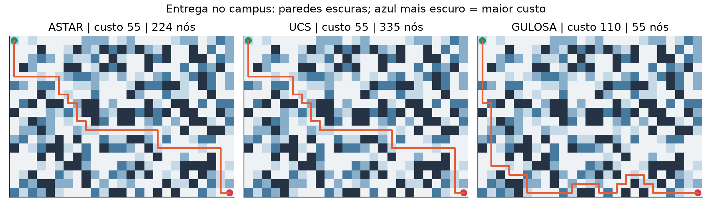
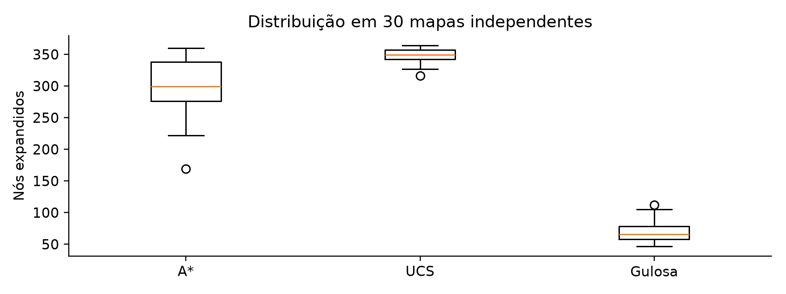
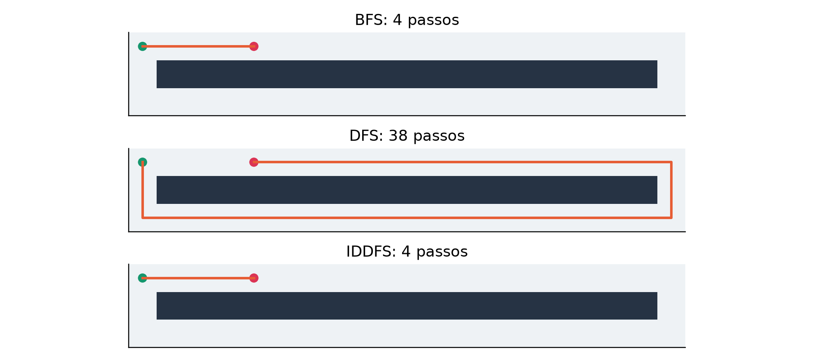
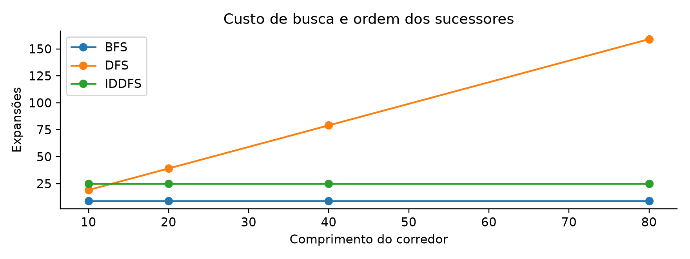
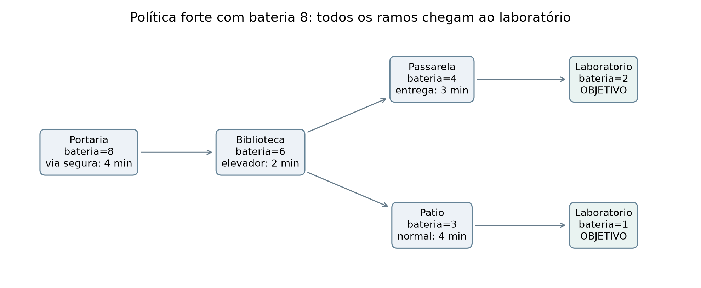
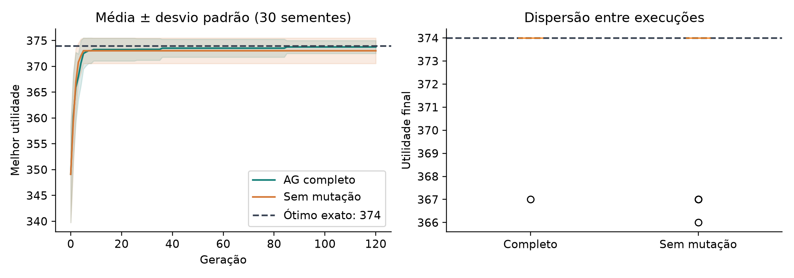
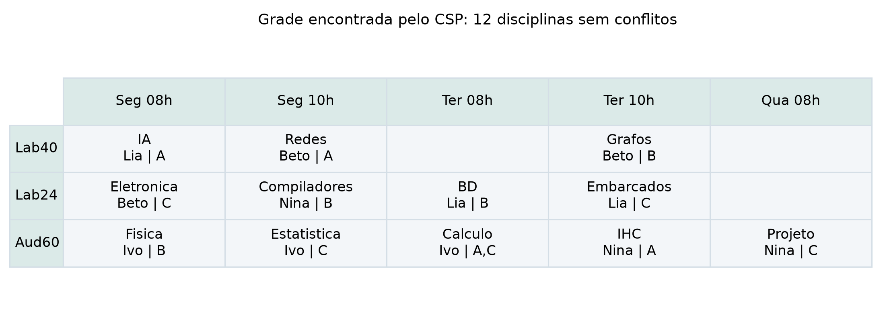
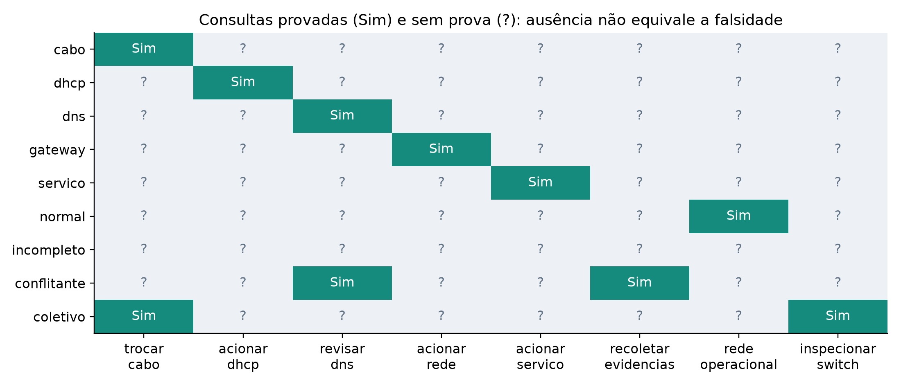

# Projeto 1 - Busca informada: rotas de entrega

Lucas Andrade Zanetti - Matrícula 24/1039645

<!-- Página 1 de 3 deste projeto -->

## 1. Problema e formulação

Um robô leva equipamentos da portaria ao laboratório e deve minimizar o custo de deslocamento. O campus é uma grade sintética de 18 linhas por 25 colunas: zero representa parede e valores 1, 2, 4 e 7 representam custos de entrada. O estado é (linha, coluna); ações movem uma célula nas quatro direções; origem (0,0), objetivo (17,24). A origem não é cobrada. O ambiente é conhecido, estático, observável e determinístico.

São gerados 30 mapas com sementes 0 a 29 e probabilidade de parede 0,23. As bordas superior e direita recebem passagens quando necessário para garantir uma solução, preservando os custos existentes e sorteando custos para células abertas. A conectividade garantida não fixa o caminho ótimo. São modelos de estudo, sem medições de terreno reais.

## 2. Algoritmos desenvolvidos

A* usa f(s)=g(s)+h(s), onde g é o custo acumulado e h é a distância Manhattan ao objetivo multiplicada pelo menor custo positivo do mapa. Cada passo muda a distância Manhattan em no máximo um e custa pelo menos esse mínimo; logo h é admissível e consistente. UCS usa apenas g e fornece uma referência exata. A busca gulosa usa apenas h, priorizando proximidade geométrica sem garantir custo mínimo.

Os três métodos usam heap de prioridade, contador de inserção para desempate, dicionário de custos e pais. Ao encontrar custo menor, atualizam o pai e inserem uma nova entrada. Entradas com custo antigo são descartadas quando retiradas; assim o heap não precisa de operação decrease-key. O objetivo é aceito ao ser retirado da fronteira. A gulosa também permite relaxamento e reabertura, mas ainda pode encerrar com uma rota cara.

```text
custos[inicio] = 0; inserir inicio com prioridade
enquanto heap não vazio:
    retirar estado s com custo g
    se g difere de custos[s]: continuar
    se s é objetivo: reconstruir pelos pais
    para cada vizinho t:
        novo = g + custo_de_entrada(t)
        se novo < custos[t]:
            custos[t] = novo; pai[t] = s
            inserir t com f(t), g(t) ou h(t)
```

## 3. Custo computacional e protocolo

Na grade, E é proporcional a V. UCS e A* com esta heurística consistente têm limite O(V log V) para a busca em grafo e O(V) de armazenamento; a gulosa com reaberturas não herda esse limite de expansões. Foram registrados custo, trajetória, entradas geradas, nós retirados válidos e pico de entradas no heap. Esse pico inclui entradas obsoletas; não representa a memória total. Tempo é uma medição por mapa, em milissegundos, sem teste de significância.

<!-- Página 2 de 3 deste projeto -->

## 4. Resultados quantitativos

| Método | Custo médio | Expansões | Pico heap | Tempo (ms) | Ótimo |
| --- | --- | --- | --- | --- | --- |
| A* | 70,77 | 298,03 | 47,10 | 0,929 | 30/30 |
| UCS | 70,77 | 348,07 | 28,90 | 0,948 | 30/30 |
| Gulosa | 126,23 | 70,67 | 38,30 | 0,237 | 0/30 |

A* e UCS concordaram no custo em 30 de 30 mapas. A* reduziu a média de expansões em 14,37%. A gulosa teve custo médio 78,38% maior que UCS e atingiu o ótimo em 0 mapas. O ganho em expansões não implica redução proporcional de tempo: heap, avaliação de h e variação de execução também interferem.



As três buscas recebem o mesmo mapa e a mesma ordem de sucessores. Os custos da figura são a soma das células efetivamente percorridas. Uma trajetória com menos passos pode custar mais ao atravessar terreno caro; é por isso que a proximidade geométrica isolada não basta.

## 5. Verificação

A suíte compara A* e UCS com um oráculo de relaxamento Bellman-Ford em 12 mapas pequenos, valida adjacência, extremidades e soma de custos de todas as rotas e verifica que a gulosa não supera o ótimo. Também cobre objetivo inicial e destino isolado. A comparação entre A* e UCS nos experimentos complementa esse oráculo independente.

Código: projetos/p01_busca_informada.py. Dados: resultados/p01.json. Reprodução: python -m projetos.p01_busca_informada. Sementes, parâmetros e trajetórias completos estão versionados.

<!-- Página 3 de 3 deste projeto -->

## 6. Análise e considerações finais



O principal potencial de A* é combinar uma função de custo explícita com informação sobre o objetivo sem perder a garantia de otimalidade nas condições implementadas. UCS é útil quando não há uma heurística confiável e como controle de correção. A gulosa pode responder rapidamente quando a qualidade da rota pode ser sacrificada, mas o custo observado mostra que esse compromisso deve ser medido.

A heurística ignora paredes e diferenças locais de terreno. Esse relaxamento explica sua validade, mas também limita o poder de orientação: muitos estados têm f parecido. O experimento registra inclusive maior pico médio de heap em A* que em UCS; a orientação heurística não garante economia em toda métrica. Não há argumento para universalizar esses resultados a outros mapas ou a robôs reais.

As instâncias possuem um corredor de conectividade nas bordas e terreno com apenas quatro custos; isso introduz viés na distribuição. Trinta mapas dão uma comparação descritiva, não uma avaliação de segurança operacional. O modelo ignora tempo de espera, pessoas, colisões, aceleração e mudanças durante o percurso. Em uma aplicação real seria necessário atualizar o mapa e replanejar.

Uma extensão relevante é comparar Manhattan com heurísticas obtidas de marcos ou distâncias pré-calculadas, incluindo o custo de preparação. Outra é avaliar mapas sem corredor imposto, registrando também a taxa de instâncias sem solução. As garantias atuais dependem de custos positivos e da consistência demonstrada; mudar a função de custo exige reexaminar esses argumentos.

## Referências e rastreabilidade

SOARES, Fabiano Araujo. Plano de Ensino: FGA0221, T01, 2º/2026. Item 9.2 (requisitos), item 9.5 (critérios) e item 10 (entrega). Documento da disciplina.

RUSSELL, Stuart; NORVIG, Peter. Artificial Intelligence: A Modern Approach. 4. ed. Pearson, 2022. Referência indicada no plano; classificação dos tópicos conferida no sumário oficial: https://aima.cs.berkeley.edu/contents. Acesso: 30 set. 2026.

# Projeto 2 - Busca não informada: corredores de evacuação

Lucas Andrade Zanetti - Matrícula 24/1039645

<!-- Página 1 de 3 deste projeto -->

## 1. Problema e modelos de corredores

Um agente precisa encontrar uma saída por corredores sem conhecer uma estimativa da distância restante. Cada célula acessível é um estado; movimentos ortogonais têm custo unitário. A solução é uma sequência de células da origem ao destino. Não se fornece qualquer heurística aos algoritmos. O ambiente é finito, estático e totalmente conhecido para a função de sucessores.

A primeira família contém dois caminhos em uma grade de três linhas e comprimento n, com n igual a 10, 20, 40 ou 80. Origem (0,0), destino (0,4); o atalho superior tem quatro passos e a volta tem 2n-2. A segunda família contém dez labirintos perfeitos de 11 por 15 células (sementes 0 a 9), gerados por abertura de corredores entre células a distância dois. Sua estrutura acessível é uma árvore: há uma única rota simples entre origem e destino.

## 2. Algoritmos desenvolvidos

BFS utiliza uma fila FIFO e visita camadas de profundidade crescente. Com custo unitário, o primeiro objetivo retirado tem o menor número de passos. DFS utiliza uma pilha LIFO e aprofunda um ramo antes de voltar. Ambas marcam estados ao inserir e mantêm pais para reconstrução. A ordem lógica de visita é baixo, direita, cima, esquerda; na DFS a inserção é invertida para preservar essa ordem na pilha.

IDDFS repete uma DFS limitada para profundidades 0, 1, 2 e assim por diante. Mantém apenas os estados da trilha atual, impedindo ciclos na mesma trilha; o conjunto é desfeito ao retornar. Não usa um conjunto global de visitados, que poderia eliminar uma visita posterior com mais profundidade disponível. Em um grafo finito, nenhuma rota simples exige mais de V-1 arestas; esse é o limite de encerramento para declarar ausência de solução.

```text
para limite de 0 até V-1:
    executar DFS_LIMITADA(inicio, limite, trilha)
    se encontrou objetivo: retornar trilha
DFS_LIMITADA(s, restante, trilha):
    se s é objetivo: retornar cópia da trilha
    se restante = 0: falhar neste ramo
    para t vizinho e fora da trilha:
        adicionar t; buscar com restante-1
        remover t ao retornar
```

## 3. Complexidade e medições

BFS e a DFS em grafo implementadas custam O(V+E) e armazenam O(V) estados/pais. O limite clássico O(b^d) de IDDFS considera fator de ramificação b>1 e profundidade ótima d; a trilha ocupa O(d). Pico da fila/pilha e comprimento da trilha são indicadores diferentes, não bytes de RAM. Expansões e gerações da IDDFS incluem todas as iterações repetidas.

<!-- Página 2 de 3 deste projeto -->

## 4. Resultados: duas rotas e labirintos

| n | BFS: passos / nós | DFS: passos / nós | IDDFS: passos / nós |
| --- | --- | --- | --- |
| 10 | 4 / 9 | 18 / 19 | 4 / 25 |
| 20 | 4 / 9 | 38 / 39 | 4 / 25 |
| 40 | 4 / 9 | 78 / 79 | 4 / 25 |
| 80 | 4 / 9 | 158 / 159 | 4 / 25 |



| 10 labirintos: média | Passos | Expansões | Pico estrutura | Tempo (ms) |
| --- | --- | --- | --- | --- |
| BFS | 49,60 | 64,80 | 2,70 | 0,116 |
| DFS | 49,60 | 50,80 | 3,30 | 0,090 |
| IDDFS | 49,60 | 1587,60 | 50,60 | 2,362 |

Nos labirintos perfeitos, os três métodos produzem a mesma distância porque a rota simples é única. A DFS pode explorá-la mais cedo pela ordem dos vizinhos; isso não a torna ótima em grafos com rotas alternativas. IDDFS repete prefixos e paga mais expansões nessa família. Nos corredores, o destino raso permite que BFS e IDDFS ignorem quase toda a volta longa.

Código: projetos/p02_busca_nao_informada.py. Resultados: resultados/p02.json. Reprodução: python -m projetos.p02_busca_nao_informada.

<!-- Página 3 de 3 deste projeto -->

## 5. Verificação e interpretação



Os testes verificam as distâncias conhecidas da família de corredores, objetivo inicial e caso sem caminho. Em oito grades unitárias pequenas, BFS e IDDFS são comparadas com distâncias de Bellman-Ford. A DFS é verificada pela rota longa esperada neste cenário, sem atribuir a ela uma garantia de caminho mínimo.

## 6. Potenciais e limitações

BFS é apropriada quando todos os passos custam o mesmo e a memória permite guardar visitados e pais. IDDFS é útil quando se deseja solução de profundidade mínima conservando somente a trilha ativa, ao custo de repetir busca. DFS pode ser uma boa exploração inicial quando qualquer solução serve ou quando a estrutura favorece o ramo escolhido. Todos os três são completos neste grafo finito com os controles de ciclos usados.

A fila e a pilha medem apenas a fronteira, não os dicionários de estados. Portanto, o pico de dois elementos nos corredores não demonstra memória constante para a BFS ou para esta DFS. IDDFS mantém a trilha, e o resultado nos labirintos mostra como uma solução profunda aumenta tanto essa trilha quanto o trabalho repetido.

As famílias foram desenhadas para isolar dois efeitos: uma saída rasa com rota alternativa e uma árvore de corredores com caminho único. Não são amostras de plantas reais e não sustentam uma conclusão universal sobre qual método é mais rápido. O gerador de labirintos também usa DFS, o que favorece estruturas com longos ramos; esse viés é explícito.

Como trabalho futuro, convém variar a posição da saída, a ordem dos vizinhos, o número de ciclos e o fator de ramificação. Para custos de movimento diferentes, BFS e IDDFS deixam de garantir menor custo total; nesse caso o projeto 1 oferece uma formulação adequada com UCS ou A*. Evacuação real ainda precisaria modelar capacidade das saídas, fluxos de pessoas e rotas acessíveis.

## Referências e rastreabilidade

SOARES, Fabiano Araujo. Plano de Ensino: FGA0221, T01, 2º/2026. Item 9.2 (requisitos), item 9.5 (critérios) e item 10 (entrega). Documento da disciplina.

RUSSELL, Stuart; NORVIG, Peter. Artificial Intelligence: A Modern Approach. 4. ed. Pearson, 2022. Referência indicada no plano; classificação dos tópicos conferida no sumário oficial: https://aima.cs.berkeley.edu/contents. Acesso: 30 set. 2026.

# Projeto 3 - Busca complexa: planejamento AND-OR

Lucas Andrade Zanetti - Matrícula 24/1039645

<!-- Página 1 de 3 deste projeto -->

## 1. Problema: entrega com desvios e bateria

O robô de entrega escolhe rotas cujos resultados dependem do ambiente. Um atalho pode terminar no átrio ou em um desvio; um elevador pode encaminhar à passarela ou ao pátio. Depois de cada ação, o robô observa o local e a energia restantes. O estado é (local, bateria), a origem é Portaria e o objetivo é Laboratorio. Cada ação tem duração fixa e uma lista de possíveis destinos com consumo energético. O modelo completo está no JSON do projeto.

Há sete locais e dez ações. A política deve chegar ao objetivo para todos os resultados permitidos sem bateria negativa, minimizando a duração no pior caso. As capacidades iniciais avaliadas são 4, 6, 8 e 11 unidades. Não são atribuídas probabilidades aos desvios: 'dois resultados' não significa chances iguais. Trata-se de planejamento não determinístico com observação completa, classificado como busca em ambientes complexos no capítulo 4 do sumário de Russell e Norvig.

## 2. Busca AND-OR desenvolvida

Em um nó OR o robô escolhe uma ação; em um nó AND a política precisa resolver todos os estados que essa ação pode produzir. A recorrência é V(s)=min_a [tempo(a)+max_o V(sucessor(s,a,o))]. O objetivo vale zero; energia negativa e estado sem ação viável valem infinito. Uma ação só pode ser selecionada pela política forte se todos os seus ramos têm valor finito.

A implementação percorre recursivamente o grafo e memoriza V(local,energia) para compartilhar subproblemas. A melhor ação é registrada em um dicionário de política. Como as transições avançam em um grafo acíclico, a recorrência termina sem precisar resolver ciclos. Como controle, uma versão otimista troca max por min, selecionando uma ação por seu melhor resultado. Essa versão pode escolher ações que também possuem ramos perdedores.

```text
VALOR(local, energia):
    se energia < 0: retornar infinito
    se local = Laboratorio: retornar 0
    melhor = infinito
    para cada ação a:
        filhos = VALOR(destino, energia-consumo)
        candidato = tempo(a) + máximo(filhos)
        se candidato < melhor:
            melhor = candidato; política[estado] = a
    memorizar e retornar melhor
```

## 3. Complexidade e verificação de garantia

Com S estados alcançados, A ações por estado e O resultados por ação, a recorrência acíclica usa O(S*A*O) tempo e O(S) de cache/política, além da pilha. S inclui estados com energias diferentes. Um avaliador separado enumera todos os desfechos da política desde a origem. A garantia exige sucesso em todos; o valor calculado deve coincidir com o maior tempo terminal. Essa enumeração pode crescer exponencialmente nos resultados.

<!-- Página 2 de 3 deste projeto -->

## 4. Resultados do planejamento

| Bateria | AND-OR: pior tempo | Garantia | Otimista: melhor tempo | Garantia |
| --- | --- | --- | --- | --- |
| 4 | Sem solução | Não | Sem solução | Não |
| 6 | 13 min | Sim | 7 min | Não |
| 8 | 10 min | Sim | 7 min | Não |
| 11 | 9 min | Sim | 6 min | Sim |



Com bateria 8, a política forte escolhe via segura (4 min), elevador (2 min) e entrega (3 min) pela passarela ou rota normal (4 min) pelo pátio. Os tempos terminais são 9 e 10 min; o valor robusto é 10. O consumo acumulado deixa respectivamente duas ou uma unidade de bateria. Todos os ramos representados alcançam o objetivo.

O planejador otimista promete 7 min com bateria 8, mas o resultado Desvio do atalho deixa somente uma unidade de energia e nenhuma continuação viável. A duração desse ramo até falhar não é tempo de entrega e não entra como sucesso. Com bateria 11, a política pode usar o atalho e ainda suportar o desvio: os tempos terminais são 7, 6 e 9 min.

Código: projetos/p03_busca_complexa.py. Resultados: resultados/p03.json, incluindo o modelo, a política por estado e todas as trajetórias terminais. Reprodução: python -m projetos.p03_busca_complexa.

<!-- Página 3 de 3 deste projeto -->

## 5. Validação e análise

A suíte enumera desfechos para capacidades de 0 a 15 e verifica: política finita implica sucesso em todos os ramos, nenhuma trajetória de sucesso usa energia negativa e o maior tempo terminal coincide com V na origem. Também verifica que aumentar bateria não piora o valor robusto. Um domínio pequeno separado, com ação rápida arriscada e ação segura mais lenta, confirma que trocar max por min altera a decisão e remove a garantia.

Para energia 4 não existe rota viável, nem mesmo sob o melhor resultado. O método retorna ausência de solução em vez de inventar uma política. Com energia 6 a via segura precisa continuar pelo contorno e a rota normal, totalizando 13 min. A diferença entre as capacidades evidencia que a autonomia energética altera as ações viáveis, e não apenas um número de custo no mesmo caminho.

## 6. Potenciais e limitações

O planejamento AND-OR devolve uma decisão para cada estado observado e explicita contingências que uma lista fixa de ações não representa. Seu potencial é oferecer garantia dentro de um conjunto conhecido de falhas ou desvios. O uso de energia no estado evita aprovar uma rota cujo custo em minutos parece bom, mas que deixaria o robô sem autonomia para terminar.

A garantia depende de a lista de resultados ser completa e de seus consumos serem corretos. O modelo ignora falhas de observação, probabilidades, recarga, colisões e mudanças nas ações. Uma nova falha fora da lista invalida a garantia operacional. A otimização do pior caso pode ser conservadora quando um desvio raro tem custo elevado; sem probabilidades justificadas, porém, não há base para substituir a garantia por custo esperado.

A versão implementada resolve somente domínios acíclicos. Em grafos com ciclos, a recursão memoizada não basta: seria preciso lidar com políticas fortes ou fortes cíclicas e suas condições de terminação. Em observabilidade parcial, o estado teria de representar conjuntos de possibilidades, aumentando o espaço de busca. A enumeração exaustiva usada na verificação também deixa de escalar quando há muitas bifurcações.

Uma extensão seria comparar política robusta com planejamento de custo esperado sob probabilidades calibradas e incluir sensores imperfeitos. O relatório mantém 'tempo no pior caso' e 'melhor tempo otimista' separados, pois são objetivos diferentes. Os resultados apresentados demonstram a importância de representar corretamente o tipo de incerteza antes de selecionar um algoritmo.

## Referências e rastreabilidade

SOARES, Fabiano Araujo. Plano de Ensino: FGA0221, T01, 2º/2026. Item 9.2 (requisitos), item 9.5 (critérios) e item 10 (entrega). Documento da disciplina.

RUSSELL, Stuart; NORVIG, Peter. Artificial Intelligence: A Modern Approach. 4. ed. Pearson, 2022. Referência indicada no plano; classificação dos tópicos conferida no sumário oficial: https://aima.cs.berkeley.edu/contents. Acesso: 30 set. 2026.

# Projeto 4 - Algoritmo genético: seleção de equipamentos

Lucas Andrade Zanetti - Matrícula 24/1039645

<!-- Página 1 de 3 deste projeto -->

## 1. Problema: carga de uma equipe de campo

Uma equipe de monitoramento ambiental do campus precisa escolher equipamentos sob duas capacidades: massa máxima de 65 unidades e volume máximo de 48. Há 24 itens, cada um com massa inteira de 3 a 16, volume de 2 a 12 e utilidade de 12 a 60. Os atributos são sintéticos, gerados com semente 2026; utilidade representa prioridade didática, sem validação por especialistas.

Cada cromossomo é um vetor binário x de 24 posições. x_i=1 inclui o item i e x_i=0 o exclui. O objetivo é maximizar a soma de utilidade_i*x_i, respeitando as duas somas de recursos. Cada item aparece no máximo uma vez. O espaço contém 2^24 seleções, embora muitas sejam inviáveis. Essa é uma mochila 0/1 com duas restrições, sem relações de dependência entre equipamentos.

## 2. Algoritmo genético desenvolvido

A população inicial contém 80 vetores aleatórios reparados. O fitness é a utilidade total de cada seleção viável. Torneios de três indivíduos escolhem dois pais; o cruzamento uniforme sorteia, para cada posição, qual pai fornece o bit. A mutação inverte cada bit independentemente com probabilidade 1/24. Há 120 transições de geração e duas posições de elitismo. O melhor fitness é registrado na geração zero e depois de cada transição.

O reparo remove repetidamente o item selecionado com menor utilidade dividida pela soma dos recursos normalizados (massa/65 + volume/48), até respeitar ambas as capacidades. O reparo e os desempates são determinísticos. Todo descendente é reparado antes de entrar na população. O elitismo conserva o melhor indivíduo e torna a sequência de melhores fitness não decrescente, sem assegurar que ela alcance o ótimo global.

```text
população = 80 cromossomos aleatórios reparados
registrar o melhor fitness inicial
repetir 120 vezes:
    ordenar por fitness; preservar os 2 melhores
    até formar a próxima população:
        selecionar dois pais por torneio de 3
        cruzar bits escolhendo um pai por posição
        inverter cada bit com probabilidade 1/24
        reparar capacidades; inserir descendente
    registrar o melhor fitness
```

## 3. Controle exato e protocolo experimental

Programação dinâmica própria usa tabela por capacidades de massa e volume. Para cada item, percorre capacidades decrescentes e compara não incluir versus incluir; uma máscara registra a seleção. O custo é O(n*M*V) e o armazenamento O(M*V) estados. O AG custa aproximadamente O(G*P*n²) com reparo por remoções sucessivas. Foram executadas 30 sementes para o AG completo e as mesmas 30 sem mutação, preservando os demais parâmetros.

<!-- Página 2 de 3 deste projeto -->

## 4. Resultados e ablação

| Método (30 execuções) | Média | Desvio padrão | Mínimo | Máximo | Ótimo |
| --- | --- | --- | --- | --- | --- |
| AG completo | 373,77 | 1,26 | 367 | 374 | 29/30 |
| Sem mutação | 373,03 | 2,47 | 366 | 374 | 26/30 |

O ótimo exato da instância é 374 unidades de utilidade. O AG completo atingiu esse valor em 29 de 30 execuções; o controle sem mutação, em 26. O desvio padrão é calculado sobre as 30 observações (divisor 30), descrevendo as sementes usadas, não uma distribuição populacional comprovada.



Uma execução ótima (semente 0) selecionou 8 itens, massa 65 e volume 46. Itens: multimetro, camera, bateria, luximetro, decibelimetro, drone, kit solo, osciloscopio. Os vetores completos e uma seleção ótima da programação dinâmica constam do JSON; diferentes seleções podem ter o mesmo valor.

A execução que não alcançou o ótimo no AG completo terminou com utilidade 367, sete unidades abaixo de 374 (lacuna de 1,87%). Esse caso é mantido na avaliação: o resultado médio não deve esconder falhas de convergência. O controle sem mutação mostra maior dispersão, embora também encontre boas soluções nesta instância.

Código: projetos/p04_algoritmo_genetico.py. Dados: resultados/p04.json. Reprodução: python -m projetos.p04_algoritmo_genetico.

<!-- Página 3 de 3 deste projeto -->

## 5. Verificação

A programação dinâmica é confrontada com enumeração de todas as 2^10 seleções de um subconjunto de dez itens, em quatro pares de capacidades, incluindo capacidade zero. Os testes validam valor, vetor e viabilidade. Para o AG, conferem reparo, viabilidade da melhor carga, monotonicidade do histórico por elitismo, limite dado pelo ótimo exato e reprodução idêntica com a mesma semente.

## 6. Potenciais e limitações

O AG combina seleções parciais e explora novas combinações por mutação; o reparo permite trabalhar apenas com candidatos admissíveis. Isso facilita acrescentar funções de utilidade mais difíceis de decompor. Os experimentos mostram convergência frequente ao ótimo, mas nenhuma condição do algoritmo garante que essa convergência ocorrerá em toda execução.

A ablação sugere contribuição da mutação para manter a exploração: com ela foram 29 acertos, sem ela 26. Trinta sementes em uma única instância não demonstram superioridade geral nem constituem um teste estatístico. A instância usa utilidades independentes, sem sinergias, itens obrigatórios ou efeitos de redundância. Além disso, o reparo favorece um critério local de eficiência; ele pode apagar combinações cujo valor depende de interações entre itens.

O método exato é preferível neste tamanho de capacidade quando se exige um certificado de ótimo: suas capacidades inteiras são pequenas e a tabela tem só 66 por 49 posições. O AG não é justificado aqui por superar a programação dinâmica em tempo, que não foi comparado. Sua contribuição é demonstrar representação, operadores, pressão seletiva, viabilidade e avaliação de um método estocástico contra uma referência verificável.

O reparo mais simples pode fazer até n remoções, recalculando medidas e razões; seu custo é quadrático em n por descendente. Guardar somas incrementais ou utilizar um reparo especializado pode reduzir trabalho. Elitismo excessivo também pode reduzir diversidade; por isso o experimento preserva apenas dois de 80 indivíduos.

Próximos estudos úteis seriam variar capacidades, quantidade de itens e distribuições de atributos, além de medir diversidade e comparar taxas de mutação. Em utilidades que envolvem dependência entre equipamentos, a função de fitness e o reparo teriam de ser reformulados. O uso de dados reais exigiria explicitar unidades físicas e justificar como a utilidade foi definida.

## Referências e rastreabilidade

SOARES, Fabiano Araujo. Plano de Ensino: FGA0221, T01, 2º/2026. Item 9.2 (requisitos), item 9.5 (critérios) e item 10 (entrega). Documento da disciplina.

RUSSELL, Stuart; NORVIG, Peter. Artificial Intelligence: A Modern Approach. 4. ed. Pearson, 2022. Referência indicada no plano; classificação dos tópicos conferida no sumário oficial: https://aima.cs.berkeley.edu/contents. Acesso: 30 set. 2026.

# Projeto 5 - CSP: alocação de salas e horários

Lucas Andrade Zanetti - Matrícula 24/1039645

<!-- Página 1 de 3 deste projeto -->

## 1. Problema e representação CSP

O campus deve alocar 12 disciplinas em cinco horários e três salas. Cada disciplina é uma variável; cada valor é um par (horário, sala). As salas são Lab40 (40 vagas, computadores), Lab24 (24 vagas, computadores) e Aud60 (60 vagas, sem computadores). Cada disciplina possui docente, grupos de alunos, tamanho, necessidade de computadores e horários permitidos.

Restrições unárias eliminam salas sem capacidade/equipamento e horários não disponíveis. Restrições binárias proíbem, no mesmo horário: compartilhar uma sala; compartilhar um docente; compartilhar pelo menos um grupo de alunos. Disciplinas de docentes e grupos distintos podem acontecer juntas em salas diferentes. Os domínios finais e os atributos sintéticos estão registrados no JSON.

## 2. Métodos desenvolvidos

O controle usa backtracking: escolhe a próxima variável na ordem da lista, percorre seus valores e verifica compatibilidade com as atribuições existentes. Ao falhar, remove a atribuição e tenta o próximo valor. Não modifica domínios de variáveis futuras. A versão otimizada escolhe a variável de menor domínio (MRV), desempatando pelo maior número de vizinhos ainda não atribuídos (grau) e pelo nome.

LCV ordena valores pela quantidade de valores incompatíveis que eliminariam dos vizinhos livres; empates seguem o próprio par. Antes da busca e após cada atribuição, AC-3 aplica consistência de arcos. Para o arco X->Y, remove cada valor de X sem qualquer valor compatível em Y. Quando X muda, reinsere arcos dos outros vizinhos em direção a X. Um domínio vazio provoca retorno imediato. Esse uso continuado de AC-3 é MAC, manutenção de consistência de arcos.

Cada ramo copia os domínios antes da propagação, de modo que o retorno restaura corretamente as opções do ramo anterior. O grafo inclui uma aresta entre disciplinas quando pelo menos um par de valores é incompatível. As atribuições completas passam por um validador separado que verifica domínio e todos os pares de disciplinas.

```text
BACKTRACK(atribuição, domínios):
    se todas atribuídas: retornar solução
    X = MRV com desempate por grau
    para valor de X em ordem LCV:
        se compatível com as atribuições:
            copiar domínios; domínio[X] = {valor}
            se AC-3 não esvaziar domínio:
                buscar com X atribuído
                se houver solução: retornar
    retornar falha
```

## 3. Complexidade e cenários

Com N variáveis e D valores por variável, backtracking permanece O(D^N) no pior caso. AC-3 clássico custa O(E*D³) por propagação, e LCV/cópias adicionam trabalho. Além da grade normal, seis disciplinas de 32 alunos, todas do mesmo professor, precisam de Lab40 em cinco horários: pelo princípio da casa dos pombos, a instância é inviável. Ambos os métodos precisam reconhecer esse fato.

<!-- Página 2 de 3 deste projeto -->

## 4. Resultados medidos

| Cenário / método | Nós | Tentativas | Retornos | Verificações | Tempo (ms) |
| --- | --- | --- | --- | --- | --- |
| normal / BT | 16 | 91 | 3 | 381 | 0,367 |
| normal / MAC | 13 | 12 | 0 | 6962 | 6,542 |
| inviavel / BT | 326 | 1630 | 326 | 4405 | 3,538 |
| inviavel / MAC | 86 | 205 | 86 | 7570 | 8,874 |

BT = backtracking simples. MAC = MRV, grau, LCV e manutenção de consistência. 'Nós' conta chamadas recursivas; 'tentativas' conta valores examinados; 'retornos' conta chamadas que esgotam seus valores. Verificações incluem compatibilidade durante LCV, busca e AC-3, mas não a construção inicial do grafo. O tempo também começa após essa construção e inclui propagação inicial, cópias e busca.



Na instância normal, os dois métodos produzem grades válidas; a versão com propagação encontra uma sem retornos. No cenário inviável, ambos retornam ausência de solução. AC-3 não elimina necessariamente a impossibilidade já na raiz: com cinco horários, cada valor ainda tem suporte individual em outro domínio. A incompatibilidade coletiva só aparece durante a busca.

Código: projetos/p05_csp.py. Dados: resultados/p05.json, incluindo disciplinas, salas, disponibilidade e as duas grades. Reprodução: python -m projetos.p05_csp.

<!-- Página 3 de 3 deste projeto -->

## 5. Verificação e leitura dos resultados

Os testes validam soluções dos dois métodos para a grade normal. Em instâncias menores com dois e três cursos do mesmo docente e dois horários, comparam a existência de solução com enumeração de todas as combinações de valores. Um curso com cem alunos verifica o tratamento de domínio vazio. O validador não usa a rotina AC-3 ou o procedimento de escolha de variáveis.

Na grade normal, MAC diminuiu de 91 para 12 as tentativas de valores. No cenário inviável, caiu de 1.630 para 205. Entretanto, as verificações de compatibilidade foram maiores e o tempo medido também: LCV e propagação têm custo fixo que pode superar o trabalho evitado em problemas pequenos. O resultado desaconselha tratar 'menos nós' como sinônimo de 'mais rápido'.

## 6. Potenciais e limitações

A modelagem declarativa separa dados e restrições da estratégia de busca: novos cursos entram como variáveis, e incompatibilidades entram na relação de pares. MRV torna visíveis decisões mais restritas; LCV tenta preservar opções futuras; MAC detecta contradições antes de construir uma atribuição completa. Esses recursos são particularmente úteis quando a grade possui restrições fortes e domínios maiores.

Consistência de arcos é uma condição local, não uma prova geral de satisfatibilidade. O caso do professor com seis cursos mostra a diferença entre compatibilidade em pares e impossibilidade coletiva. Uma restrição global AllDifferent para os horários desse professor poderia reconhecer tal deficiência mais cedo com propagação apropriada. O projeto usa apenas restrições binárias, mantendo transparente o que AC-3 consegue inferir.

A solução atende restrições duras, mas não otimiza preferências, intervalos de descanso, deslocamentos entre prédios ou distribuição da carga semanal. Os cursos possuem uma única aula e os cinco horários são abstrações. Não há cadastro real de estudantes, salas ou docentes. Uma grade válida pode ser pouco conveniente; seria necessário um problema de otimização com pesos para preferências.

O uso de cópias integrais simplifica a restauração de estado e a revisão do código, mas aumenta alocações. Escala maior justificaria um registro incremental de remoções para desfazer cada ramo. Outros estudos possíveis são separar ablações de MRV, LCV e MAC, variar densidade de conflitos e acrescentar restrições globais. Uma medição robusta de tempo exigiria repetições e controle do ambiente, ausentes nesta comparação ilustrativa.

## Referências e rastreabilidade

SOARES, Fabiano Araujo. Plano de Ensino: FGA0221, T01, 2º/2026. Item 9.2 (requisitos), item 9.5 (critérios) e item 10 (entrega). Documento da disciplina.

RUSSELL, Stuart; NORVIG, Peter. Artificial Intelligence: A Modern Approach. 4. ed. Pearson, 2022. Referência indicada no plano; classificação dos tópicos conferida no sumário oficial: https://aima.cs.berkeley.edu/contents. Acesso: 30 set. 2026.

# Projeto 6 - Banco de conhecimentos: triagem de rede

Lucas Andrade Zanetti - Matrícula 24/1039645

<!-- Página 1 de 3 deste projeto -->

## 1. Problema e banco de conhecimentos

Um laboratório precisa justificar recomendações de triagem quando computadores não acessam um serviço. O banco de conhecimentos contém 16 regras proposicionais de Horn e fatos observados para cada atendimento. Não há treino de modelo: o raciocínio decorre de premissas e regras explícitas. São avaliados nove cenários sintéticos, de cabo danificado a evidências incompletas ou conflitantes, e oito consultas de recomendação/estado em cada cenário.

Uma regra tem identificador, conjunto de premissas e uma conclusão: p1 & ... & pn -> q. Por exemplo, ip_valido & gateway_responde & dns_falha -> falha_dns (R05), e falha_dns -> revisar_dns (R06). A base distingue observação, diagnóstico derivado e recomendação. A grafia dos símbolos é o vocabulário formal; fatos de atendimentos diferentes não são misturados.

## 2. Encadeamento para frente

O motor parte dos fatos e calcula o fecho de consequências. Um índice relaciona cada premissa às regras que a utilizam; cada regra mantém a quantidade de premissas ainda não processadas. Uma agenda contém os fatos novos. Retirar um fato decrementa os contadores das regras dependentes; quando um contador chega a zero, a regra dispara. Uma conclusão nova entra na agenda e recebe uma prova com identificador da regra e provas das premissas. Fatos já conhecidos não são reenfileirados.

## 3. Encadeamento para trás

O segundo motor recebe uma consulta. Se ela já é fato, devolve uma prova direta. Caso contrário, tenta as regras que concluem esse símbolo (alternativas OR) e prova todas as premissas de cada uma (requisitos AND). Um conjunto de ancestrais impede recursão circular; só provas bem-sucedidas são memorizadas, pois uma falha sob bloqueio de ciclo pode depender da trilha atual. Se nenhuma alternativa funciona, o retorno é 'sem prova', e não 'falso'.

```text
PROVAR(q, ancestrais):
    se q é fato: retornar prova observada
    se há prova memorizada: retornar prova
    se q está nos ancestrais: falhar neste ramo
    para cada regra que conclui q:
        provar todas as premissas com q nos ancestrais
        se todas têm prova:
            construir árvore, memorizar e retornar
    retornar sem prova
```

## 4. Semântica e complexidade

A base usa conhecimento positivo; 'dns_falha' é um símbolo que exige evidência, não a negação inferida da falta de 'dns_responde'. Regras R11 a R14 detectam relatos explicitamente opostos e recomendam recoleta. Para a frente, agenda e contadores percorrem O(F+L+R) ocorrências, com F fatos, L premissas e R regras; árvores de prova serializadas podem ocupar mais espaço. Para trás, alternativas e ciclos podem gerar busca exponencial; o cache de sucessos não remove todo esse custo.

<!-- Página 2 de 3 deste projeto -->

## 5. Resultados e explicações

| Cenário | Fatos de entrada | Novos fatos | Regras disparadas | Consultas provadas |
| --- | --- | --- | --- | --- |
| cabo | 2 | 2 | 2 | 1 |
| dhcp | 3 | 2 | 2 | 1 |
| dns | 3 | 2 | 2 | 1 |
| gateway | 3 | 2 | 2 | 1 |
| servico | 4 | 2 | 2 | 1 |
| normal | 4 | 1 | 1 | 1 |
| incompleto | 1 | 0 | 0 | 0 |
| conflitante | 4 | 4 | 4 | 2 |
| coletivo | 3 | 3 | 3 | 2 |



Os motores concordaram em 72 de 72 pares de consulta/cenário. Essa concordância verifica consistência entre duas estratégias implementadas; não mede acurácia operacional dos diagnósticos. Não há rótulos empíricos de incidentes reais e as regras são hipóteses didáticas explícitas.

No cenário DNS, os três fatos ip_valido, gateway_responde e dns_falha permitem R05 concluir falha_dns; R06 conclui revisar_dns. A recomendação é acompanhada por essa árvore de prova. No cenário incompleto, apenas link_ativo é observado e nenhuma das oito consultas é provada. No cenário conflitante, dns_responde e dns_falha levam à recomendação de recoleta de evidências, além da revisão DNS.

Código: projetos/p06_base_conhecimento.py. Dados: resultados/p06.json, incluindo regras, fatos, métricas e árvores de prova dos dois motores. Reprodução: python -m projetos.p06_base_conhecimento.

<!-- Página 3 de 3 deste projeto -->

## 6. Verificação e interpretação

Os testes conferem concordância nos 72 casos e validam cada árvore de prova contra os fatos e as premissas da regra registrada. Também cobrem ciclos sem suporte, ciclos com uma alternativa sustentada por fato e regras sem premissas. Em 25 bases aleatórias pequenas, ambos os motores são comparados com um oráculo que repete a aplicação de regras até um ponto fixo. O teste de ausência de evidência confirma que não se conclui falha ou funcionamento a partir apenas de link ativo.

A prova é uma justificativa lógica em relação à base fornecida. Não certifica que a premissa foi observada corretamente ou que uma regra representa todas as causas possíveis de falha. Por exemplo, resposta do gateway e falha de DNS também podem coexistir com outros incidentes não modelados. A interpretação correta é 'esta recomendação foi sustentada por estas regras e estes fatos'.

## 7. Potenciais e limitações

O banco de conhecimentos oferece explicações verificáveis e permite revisar uma regra sem treinar um modelo. Encadeamento para frente atende várias consultas após construir um único fecho; para trás explora dependências pertinentes a uma consulta. O custo relativo depende do número de consultas e de regras relevantes. Os dados incluem contagens de trabalho para cada motor, mas não foi realizado benchmark de velocidade entre eles.

As regras positivas de Horn têm expressividade limitada: não representam graus de confiança, exceções padrão, preferências entre recomendações ou quantificação sobre múltiplas máquinas. Símbolos como falha e resposta são átomos distintos; a inconsistência é detectada por regras específicas, sem aplicar o princípio de explosão da lógica clássica a toda a base. Recoletar evidências é uma recomendação derivada, não um bloqueio automático das outras recomendações.

A inferência é monotônica durante um atendimento: acrescentar fatos conserva conclusões. Uma observação corrigida exige executar novamente a base com o novo conjunto de fatos. Não há remoção incremental de suporte ou atualização temporal. O projeto não executa ações sobre a rede; a saída é uma lista de conclusões e suas provas.

Para evoluir o sistema, convém obter regras revisadas por responsáveis de infraestrutura, separar incidentes por equipamento, registrar horários e testar cenários de causas simultâneas. Lógica de primeira ordem ampliaria a representação; mecanismos probabilísticos tratariam a confiabilidade das observações. Esses recursos exigem outra semântica e não devem ser adicionados sem explicar como afetam as garantias do motor atual.

## Referências e rastreabilidade

SOARES, Fabiano Araujo. Plano de Ensino: FGA0221, T01, 2º/2026. Item 9.2 (requisitos), item 9.5 (critérios) e item 10 (entrega). Documento da disciplina.

RUSSELL, Stuart; NORVIG, Peter. Artificial Intelligence: A Modern Approach. 4. ed. Pearson, 2022. Referência indicada no plano; classificação dos tópicos conferida no sumário oficial: https://aima.cs.berkeley.edu/contents. Acesso: 30 set. 2026.

POOLE, David L.; MACKWORTH, Alan K. Artificial Intelligence: Foundations of Computational Agents. 3. ed. Seção 5.3: Propositional Definite Clauses. https://artint.info/3e/html/ArtInt3e.Ch5.S3.html. Acesso: 30 set. 2026.
